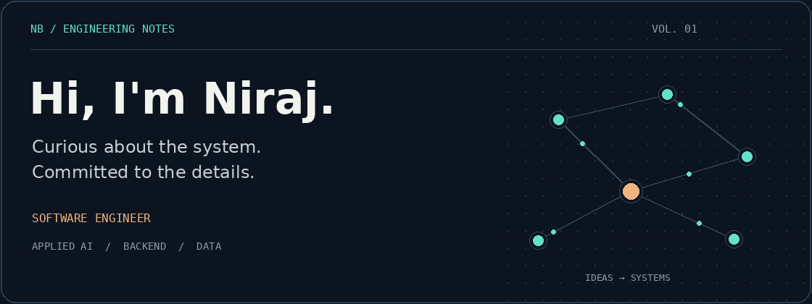

  

# Hi, I'm Niraj

I'm a software engineer and Computer Science graduate from Southeastern Louisiana University.

I work across full-stack development, backend systems, and data applications. My work includes internal business tools, data pipelines, and projects involving machine learning. I enjoy bringing different technologies together to make business processes and operations work better.

I'm interested in technology and AI, particularly in how they can help solve everyday problems. I like learning through hands-on projects, exploring unfamiliar tools, and improving my understanding of the software I build.

Outside of day-to-day work, I keep up with new developments in tech and enjoy exchanging ideas with others.

## GitHub activity

  

